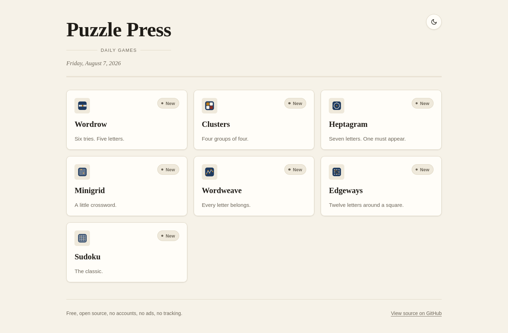
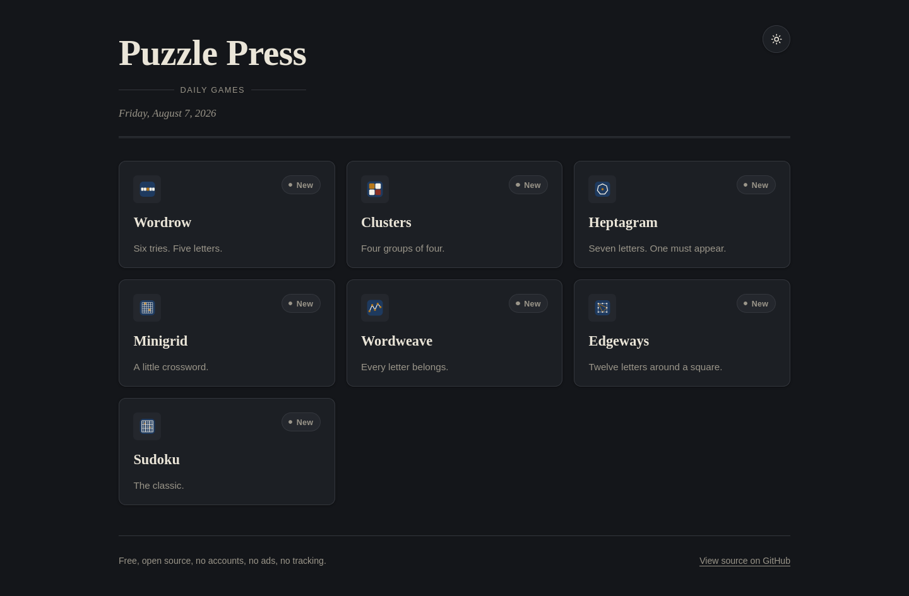
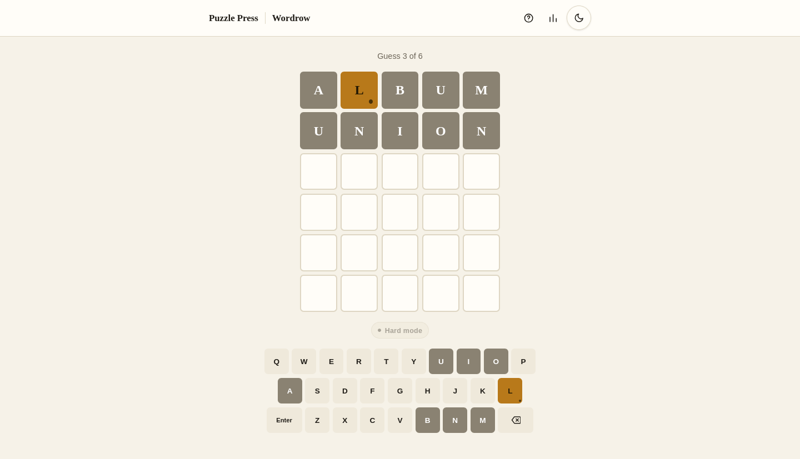

# Puzzle Press

Seven daily puzzles on one static page. Plain HTML, CSS and JS with zero
dependencies, and nothing asks you to sign in. Play at
https://munzzyy.github.io/puzzlepress/ or serve the folder yourself.

| Light | Dark |
| --- | --- |
|  |  |

## The games

Wordrow gives you six tries at a five letter word, with a hard mode if you
want it. Clusters asks you to sort sixteen tiles into four themed groups
before your fourth mistake. Heptagram hands you seven letters and one of them
has to appear in every word you build. Minigrid is a 5x5 crossword with hand
written clues. Wordweave hides theme words in a grid of letters; one of them
spans the board and names the theme. Edgeways puts twelve letters around a
square and you chain words until every letter is used. Sudoku is the classic,
with easy, medium and hard boards each day plus pencil marks and undo.



More screenshots live in [docs/shots](docs/shots).

## Run it locally

```
git clone https://github.com/munzzyy/puzzlepress
cd puzzlepress
python3 -m http.server
```

Open http://localhost:8000. Any static file server works. The site also
installs as a PWA and keeps working offline once you have visited it.

## How the dailies work

Each game ships with a committed bank of puzzles in `data/`. Your browser
picks today's puzzle by counting days since the launch date and taking that
index into the bank, wrapping around when it runs out. Same date, same puzzle,
everywhere, with no server involved.

Fair warning: the banks are plain JSON in a public repo, so today's answers
are one file away. Peeking only ruins your own streak.

## Regenerating the banks

Each `tools/gen_<game>.py` rebuilds its `data/<game>.json`. They are stdlib
Python, deterministic with `--seed`, and validate their own output before
writing anything. You should not need to run them unless you want a different
bank.

## Tests

```
node --test assets/shared.test.mjs games/*/core.test.mjs
python3 -m pytest -q
```

The node suites cover game logic (all of it lives in `games/<id>/core.js`
with no DOM in sight). The pytest suites check every bank against its schema
and invariants: sudoku uniqueness, wordweave grids tiling fully, minigrid
clues matching their answers, and so on.

## Honest limits

- Word "commonness" is human judgment. We found no permissively licensed
  English frequency list, so the answer lists were curated by hand while the
  full guess dictionaries come straight from the public domain ENABLE list,
  which accepts words like ZOEAE. The occasional obscure but valid word will
  show up.
- Profanity filtering on the big dictionaries is a best effort blocklist,
  not a linguistic audit. The curated answer lists are clean.
- Sudoku's hard tier is one wide bucket, graded by solving technique rather
  than a full named-technique ladder. Some hard days are harder than others.
- Minigrid uses two block layouts across its bank. The other valid 5x5
  shapes produced no clean fills from the curated vocabulary, so they are
  not in there.
- Sudoku cells land around 38px on a 360px phone, under the 44px touch
  guideline. Nine cells across a small screen leaves no way around it; every
  other control is 44px or better.
- Day numbering starts at the launch date, so the archive is only as old as
  the site.

## License

MIT. The word list is the public domain ENABLE list; sources are recorded in
[data/ATTRIBUTION.md](data/ATTRIBUTION.md).
